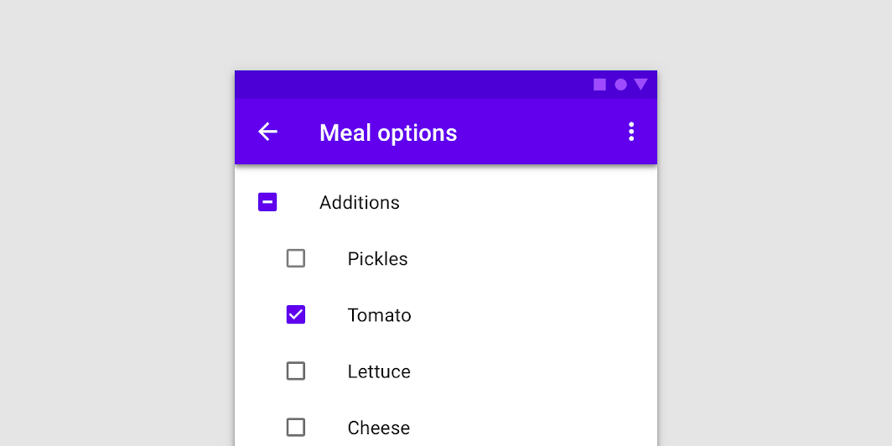
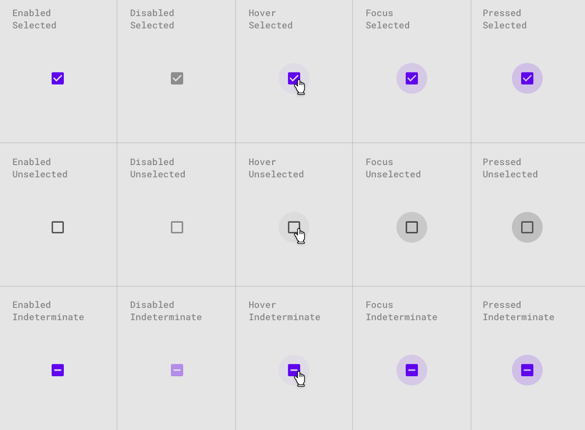

<!--docs:
title: "Checkboxes"
layout: detail
section: components
excerpt: "Checkboxes allow the user to select multiple options from a set."
iconId: selection_control
path: /catalog/input-controls/checkboxes/
-->

# Selection controls: checkboxes

[Selection controls](https://material.io/components/selection-controls#usage) allow the user to select options.

Use checkboxes to:

* Select one or more options from a list
* Present a list containing sub-selections
* Turn an item on or off in a desktop environment



**Contents**

* [Using checkboxes](#using-checkboxes)
* [Checkboxes](#checkboxes)
* [Other variants](#other-variants)
* [API](#api)
* [Usage within web frameworks](#usage-within-web-frameworks)

## Using checkboxes

Checkboxes allow the user to select one or more items from a set. Checkboxes can be used to turn an option on or off.

### Installing checkboxes

```
npm install @material/checkbox
```

### Styles

```scss
@use "@material/checkbox";
@use "@material/form-field";

@include checkbox.core-styles;
@include form-field.core-styles;
```

**Note: The form field styles are only required when the checkbox is used with the form field.**

### JavaScript instantiation

The checkbox will work without JavaScript, but you can enhance it with a ripple interaction effect by instantiating `MDCCheckbox` on the `mdc-checkbox` element. To activate the ripple effect upon interacting with the label, you must also instantiate `MDCFormField` on the `mdc-form-field` element and set the `MDCCheckbox` instance as its `input`.

```js
import {MDCFormField} from '@material/form-field';
import {MDCCheckbox} from '@material/checkbox';

const checkbox = new MDCCheckbox(document.querySelector('.mdc-checkbox'));
const formField = new MDCFormField(document.querySelector('.mdc-form-field'));
formField.input = checkbox;
```

> See [Importing the JS component](../../docs/importing-js.md) for more information on how to import JavaScript.

### Making checkboxes accessible

Material Design spec advises that touch targets should be at least 48px x 48px.
To meet this requirement, add the `mdc-checkbox--touch` class to your checkbox as follows:

```html
<div class="mdc-touch-target-wrapper">
  <div class="mdc-checkbox mdc-checkbox--touch">
    <input type="checkbox"
           class="mdc-checkbox__native-control"
           id="checkbox-1"/>
    <div class="mdc-checkbox__background">
      <svg class="mdc-checkbox__checkmark"
           viewBox="0 0 24 24">
        <path class="mdc-checkbox__checkmark-path"
              fill="none"
              d="M1.73,12.91 8.1,19.28 22.79,4.59"/>
      </svg>
      <div class="mdc-checkbox__mixedmark"></div>
    </div>
    <div class="mdc-checkbox__ripple"></div>
  </div>
</div>
```

Note that the outer `mdc-touch-target-wrapper` element is only necessary if you want to avoid potentially overlapping touch targets on adjacent elements (due to collapsing margins).

## Checkboxes

We recommend using MDC Checkbox with [MDC Form Field](../mdc-form-field) for enhancements such as label alignment, label activation of the ripple interaction effect, and RTL-awareness.

### Checkbox example

```html
<div class="mdc-form-field">
  <div class="mdc-checkbox">
    <input type="checkbox"
           class="mdc-checkbox__native-control"
           id="checkbox-1"/>
    <div class="mdc-checkbox__background">
      <svg class="mdc-checkbox__checkmark"
           viewBox="0 0 24 24">
        <path class="mdc-checkbox__checkmark-path"
              fill="none"
              d="M1.73,12.91 8.1,19.28 22.79,4.59"/>
      </svg>
      <div class="mdc-checkbox__mixedmark"></div>
    </div>
    <div class="mdc-checkbox__ripple"></div>
  </div>
  <label for="checkbox-1">Checkbox 1</label>
</div>
```

**Note: If you are using IE, you need to include a closing `</path>` tag if you wish to avoid console warnings.**

### Checkbox states

Checkboxes can be selected, unselected, or indeterminate. Checkboxes have enabled, disabled, hover, focused, and pressed states.



## Other variants

### Disabled checkboxes

Note that `mdc-checkbox--disabled` is necessary on the root element of CSS-only checkboxes to prevent hover states from activating. Checkboxes that use the JavaScript component do not need this class; a `disabled` attribute on the `<input>` element is sufficient.

```html
<div class="mdc-checkbox mdc-checkbox--disabled">
  <input type="checkbox"
         id="basic-disabled-checkbox"
         class="mdc-checkbox__native-control"
         disabled />
  <div class="mdc-checkbox__background">
    <svg class="mdc-checkbox__checkmark"
         viewBox="0 0 24 24">
      <path class="mdc-checkbox__checkmark-path"
            fill="none"
            d="M1.73,12.91 8.1,19.28 22.79,4.59"/>
    </svg>
    <div class="mdc-checkbox__mixedmark"></div>
  </div>
  <div class="mdc-checkbox__ripple"></div>
</div>
<label for="basic-disabled-checkbox" id="basic-disabled-checkbox-label">This is my disabled checkbox</label>
```

### Indeterminate checkboxes

Note that `data-indeterminate="true"` is necessary on the input element for initial render, or in a CSS-only mode. Checkboxes that use the Javascript component can modify the `indeterminate` property at runtime.

```html
<div class="mdc-checkbox">
  <input type="checkbox"
         id="basic-indeterminate-checkbox"
         class="mdc-checkbox__native-control"
         data-indeterminate="true"/>
  <div class="mdc-checkbox__background">
    <svg class="mdc-checkbox__checkmark"
         viewBox="0 0 24 24">
      <path class="mdc-checkbox__checkmark-path"
            fill="none"
            d="M1.73,12.91 8.1,19.28 22.79,4.59"/>
    </svg>
    <div class="mdc-checkbox__mixedmark"></div>
  </div>
  <div class="mdc-checkbox__ripple"></div>
</div>
<label for="basic-indeterminate-checkbox" id="basic-indeterminate-checkbox-label">This is my indeterminate checkbox</label>
```

## API

### Sass mixins

MDC Checkbox uses [MDC Theme](../mdc-theme)'s `secondary` color by default for "marked" states (i.e., checked or indeterminate).

Mixin | Description
--- | ---
`container-colors($unmarked-stroke-color, $unmarked-fill-color, $marked-stroke-color, $marked-fill-color, $generate-keyframes)` | Sets stroke & fill colors for both marked and unmarked state of enabled checkbox. Set $generate-keyframes to false to prevent the mixin from generating @keyframes.
`disabled-container-colors($unmarked-stroke-color, $unmarked-fill-color, $marked-stroke-color, $marked-fill-color)` | Sets stroke & fill colors for both marked and unmarked state of disabled checkbox.
`ink-color($color)` | Sets the ink color of the checked and indeterminate icons for an enabled checkbox
`disabled-ink-color($color)` | Sets the ink color of the checked and indeterminate icons for a disabled checkbox
`focus-indicator-color($color)` | Sets the color of the focus indicator (ripple) when checkbox is selected or is in indeterminate state.
`ripple-size($ripple-size)` | Sets the ripple size of the checkbox.
`density($density-scale)` | Sets density scale for checkbox, Supported density scales are `-3`, `-2`, `-1`, and `0` (default).

The ripple effect for the Checkbox component is styled using [MDC Ripple](../mdc-ripple) mixins.

### `MDCCheckbox` properties and methods

Property Name | Type | Description
--- | --- | ---
`checked` | `boolean` | Setter/getter for the checkbox's checked state
`indeterminate` | `boolean` | Setter/getter for the checkbox's indeterminate state
`disabled` | `boolean` | Setter/getter for the checkbox's disabled state
`value` | `string` | Setter/getter for the checkbox's

## Usage within web frameworks

If you are using a JavaScript framework, such as React or Angular, you can create a Checkbox for your framework. Depending on your needs, you can use the _Simple Approach: Wrapping MDC Web Vanilla Components_, or the _Advanced Approach: Using Foundations and Adapters_. Please follow the instructions [here](../../docs/integrating-into-frameworks.md).

### `MDCCheckboxAdapter`

Method Signature | Description
--- | ---
`addClass(className: string) => void` | Adds a class to the root element.
`removeClass(className: string) => void` | Removes a class from the root element.
`forceLayout() => void` | Force-trigger a layout on the root element. This is needed to restart animations correctly. If you find that you do not need to do this, you can simply make it a no-op.
`isAttachedToDOM() => boolean` | Returns true if the component is currently attached to the DOM, false otherwise.
`isIndeterminate() => boolean` | Returns true if the component is in the indeterminate state.
`isChecked() => boolean` | Returns true if the component is checked.
`hasNativeControl() => boolean` | Returns true if the input is present in the component.
`setNativeControlDisabled(disabled: boolean) => void` | Sets the input to disabled.
`setNativeControlAttr(attr: string, value: string) => void` | Sets an HTML attribute to the given value on the native input element.
`removeNativeControlAttr(attr: string) => void` | Removes an attribute from the native input element.

### `MDCCheckboxFoundation`

Method Signature | Description
--- | ---
`setDisabled(disabled: boolean) => void` | Updates the `disabled` property on the underlying input. Does nothing when the underlying input is not present.
`handleAnimationEnd() => void` | `animationend` event handler that should be applied to the root element.
`handleChange() => void` | `change` event handler that should be applied to the checkbox element.
